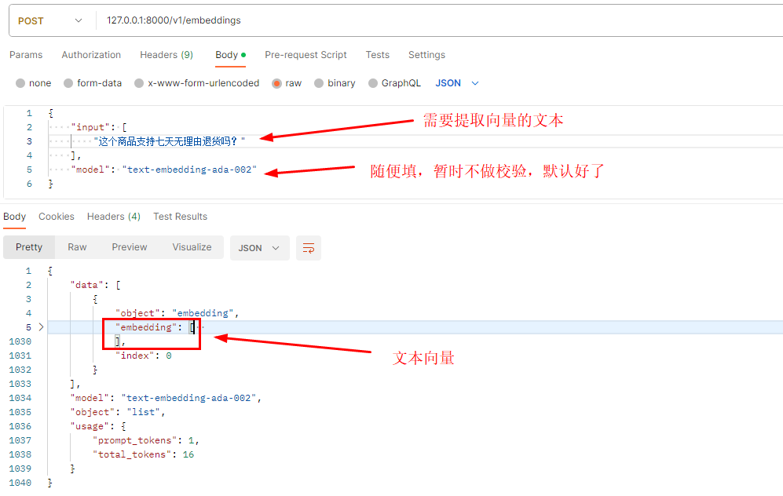

# 基于BAAI/bge-large-zh-v1.5模型的文本向量提取工具

参考模型地址：https://huggingface.co/BAAI/bge-large-zh-v1.5

## 安装

## 环境变量

| 变量                | 解释                                                                                                                                |
|-------------------|-----------------------------------------------------------------------------------------------------------------------------------|
| EMBEDDING_PATH    | 模型路径，可使用本地模型，一般指定huggingface上的模型，如默认使用：BAAI/bge-large-zh-v1.5模型，更多模型可参考文本向量化模型评估排名：https://huggingface.co/spaces/mteb/leaderboard |
| EMBEDDING_HOST    | 服务监听ip,默认：0.0.0.0                                                                                                                 |
| EMBEDDING_PORT    | 服务监听端口,默认：8000                                                                                                                    |
| EMBEDDING_WORKERS | 服务工作进程数量，默认1，内存足够情况下可增大该值                                                                                                         |

### 方式一：本地python环境启动

安装所需软件包

``` 
pip install -i https://mirror.baidu.com/pypi/simple -r requirements.txt
```

启动

``` 
python main.py
```

### 方式二：docker-compose一键安装

```
docker-compose up -d
```

注意：初次启动时需要下载模型文件，需要等待一段时间，具体看网速，可查看运行过程相关输出日志

## 相关接口

提供的接口：http://127.0.0.1:8000/v1/embeddings

与openai的embeddings接口兼容

参考：https://platform.openai.com/docs/guides/embeddings

